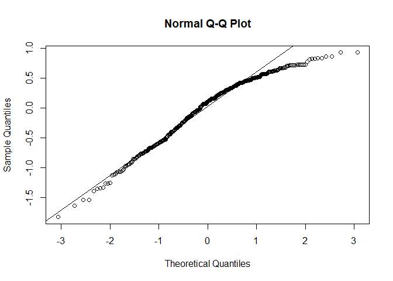

Activity 4 - Day 1
================

``` r
# Required packages
library(tidyverse)
library(tidymodels)
```

``` r
library(GGally)
```

# Loading the data

``` r
evals <- readr::read_tsv("https://www.openintro.org/data/tab-delimited/evals.txt")
```

    ## Rows: 463 Columns: 23
    ## -- Column specification --------------------------------------------------------
    ## Delimiter: "\t"
    ## chr  (9): rank, ethnicity, gender, language, cls_level, cls_profs, cls_credi...
    ## dbl (14): course_id, prof_id, score, age, cls_perc_eval, cls_did_eval, cls_s...
    ## 
    ## i Use `spec()` to retrieve the full column specification for this data.
    ## i Specify the column types or set `show_col_types = FALSE` to quiet this message.

``` r
glimpse(evals)
```

    ## Rows: 463
    ## Columns: 23
    ## $ course_id     <dbl> 1, 2, 3, 4, 5, 6, 7, 8, 9, 10, 11, 12, 13, 14, 15, 16, 1~
    ## $ prof_id       <dbl> 1, 1, 1, 1, 2, 2, 2, 3, 3, 4, 4, 4, 4, 4, 4, 4, 4, 5, 5,~
    ## $ score         <dbl> 4.7, 4.1, 3.9, 4.8, 4.6, 4.3, 2.8, 4.1, 3.4, 4.5, 3.8, 4~
    ## $ rank          <chr> "tenure track", "tenure track", "tenure track", "tenure ~
    ## $ ethnicity     <chr> "minority", "minority", "minority", "minority", "not min~
    ## $ gender        <chr> "female", "female", "female", "female", "male", "male", ~
    ## $ language      <chr> "english", "english", "english", "english", "english", "~
    ## $ age           <dbl> 36, 36, 36, 36, 59, 59, 59, 51, 51, 40, 40, 40, 40, 40, ~
    ## $ cls_perc_eval <dbl> 55.81395, 68.80000, 60.80000, 62.60163, 85.00000, 87.500~
    ## $ cls_did_eval  <dbl> 24, 86, 76, 77, 17, 35, 39, 55, 111, 40, 24, 24, 17, 14,~
    ## $ cls_students  <dbl> 43, 125, 125, 123, 20, 40, 44, 55, 195, 46, 27, 25, 20, ~
    ## $ cls_level     <chr> "upper", "upper", "upper", "upper", "upper", "upper", "u~
    ## $ cls_profs     <chr> "single", "single", "single", "single", "multiple", "mul~
    ## $ cls_credits   <chr> "multi credit", "multi credit", "multi credit", "multi c~
    ## $ bty_f1lower   <dbl> 5, 5, 5, 5, 4, 4, 4, 5, 5, 2, 2, 2, 2, 2, 2, 2, 2, 7, 7,~
    ## $ bty_f1upper   <dbl> 7, 7, 7, 7, 4, 4, 4, 2, 2, 5, 5, 5, 5, 5, 5, 5, 5, 9, 9,~
    ## $ bty_f2upper   <dbl> 6, 6, 6, 6, 2, 2, 2, 5, 5, 4, 4, 4, 4, 4, 4, 4, 4, 9, 9,~
    ## $ bty_m1lower   <dbl> 2, 2, 2, 2, 2, 2, 2, 2, 2, 3, 3, 3, 3, 3, 3, 3, 3, 7, 7,~
    ## $ bty_m1upper   <dbl> 4, 4, 4, 4, 3, 3, 3, 3, 3, 3, 3, 3, 3, 3, 3, 3, 3, 6, 6,~
    ## $ bty_m2upper   <dbl> 6, 6, 6, 6, 3, 3, 3, 3, 3, 2, 2, 2, 2, 2, 2, 2, 2, 6, 6,~
    ## $ bty_avg       <dbl> 5.000, 5.000, 5.000, 5.000, 3.000, 3.000, 3.000, 3.333, ~
    ## $ pic_outfit    <chr> "not formal", "not formal", "not formal", "not formal", ~
    ## $ pic_color     <chr> "color", "color", "color", "color", "color", "color", "c~

Plotting a density graph to display the distribution of score

``` r
ggplot(evals, aes(x = score)) +
  geom_density()
```

<!-- -->

The density distribution of score variable is negatively skewed.s

``` r
ggplot(evals, aes(x = age,y = score)) +
  geom_point()
```

<!-- -->

# Pairwise Relationships for beauty rating variables

``` r
evals %>%
  select(starts_with("bty_")) %>%
  ggpairs()
```

<!-- -->

All of the variables have high correlation so using all of them in the
regression model will not add much value. Thus we can use average beauty
score to represent the seven variables in the model.

# Multiple linear regression: one quantitative predictor, one qualitative predictor

``` r
m_bty_gen <- lm(score ~ bty_avg + gender, data = evals)
tidy(m_bty_gen)
```

    ## # A tibble: 3 x 5
    ##   term        estimate std.error statistic   p.value
    ##   <chr>          <dbl>     <dbl>     <dbl>     <dbl>
    ## 1 (Intercept)   3.75      0.0847     44.3  6.23e-168
    ## 2 bty_avg       0.0742    0.0163      4.56 6.48e-  6
    ## 3 gendermale    0.172     0.0502      3.43 6.52e-  4

``` r
summary(m_bty_gen)
```

    ## 
    ## Call:
    ## lm(formula = score ~ bty_avg + gender, data = evals)
    ## 
    ## Residuals:
    ##     Min      1Q  Median      3Q     Max 
    ## -1.8305 -0.3625  0.1055  0.4213  0.9314 
    ## 
    ## Coefficients:
    ##             Estimate Std. Error t value Pr(>|t|)    
    ## (Intercept)  3.74734    0.08466  44.266  < 2e-16 ***
    ## bty_avg      0.07416    0.01625   4.563 6.48e-06 ***
    ## gendermale   0.17239    0.05022   3.433 0.000652 ***
    ## ---
    ## Signif. codes:  0 '***' 0.001 '**' 0.01 '*' 0.05 '.' 0.1 ' ' 1
    ## 
    ## Residual standard error: 0.5287 on 460 degrees of freedom
    ## Multiple R-squared:  0.05912,    Adjusted R-squared:  0.05503 
    ## F-statistic: 14.45 on 2 and 460 DF,  p-value: 8.177e-07

The R squared is very low.

``` r
m_bty_gen = lm(score ~ bty_avg + gender, data = evals)
qqnorm(m_bty_gen$residuals)
qqline(m_bty_gen$residuals)
```

<!-- -->

We can assume that the data is pretty much normal.

``` r
plot(m_bty_gen$residuals)
abline(h = 0, lty = 3)
```

<!-- -->

The data also appears to be linear so the assumption are met.

Model for beauty average and rank

``` r
m_bty_rank = lm(score ~ bty_avg + rank, data = evals)
summary(m_bty_rank)
```

    ## 
    ## Call:
    ## lm(formula = score ~ bty_avg + rank, data = evals)
    ## 
    ## Residuals:
    ##     Min      1Q  Median      3Q     Max 
    ## -1.8713 -0.3642  0.1489  0.4103  0.9525 
    ## 
    ## Coefficients:
    ##                  Estimate Std. Error t value Pr(>|t|)    
    ## (Intercept)       3.98155    0.09078  43.860  < 2e-16 ***
    ## bty_avg           0.06783    0.01655   4.098 4.92e-05 ***
    ## ranktenure track -0.16070    0.07395  -2.173   0.0303 *  
    ## ranktenured      -0.12623    0.06266  -2.014   0.0445 *  
    ## ---
    ## Signif. codes:  0 '***' 0.001 '**' 0.01 '*' 0.05 '.' 0.1 ' ' 1
    ## 
    ## Residual standard error: 0.5328 on 459 degrees of freedom
    ## Multiple R-squared:  0.04652,    Adjusted R-squared:  0.04029 
    ## F-statistic: 7.465 on 3 and 459 DF,  p-value: 6.88e-05
